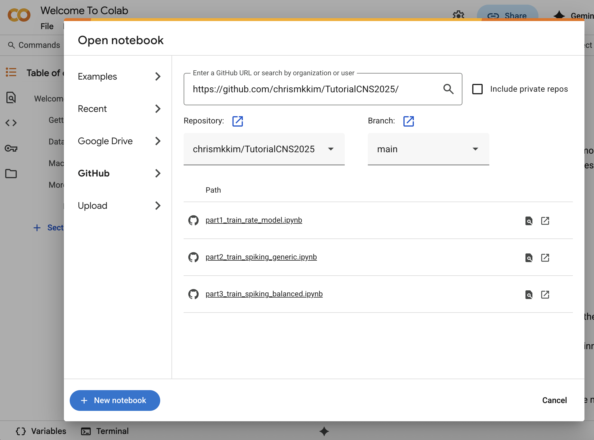

# Running the notebooks that accompany this tutorial

This document explains how to run the Jupyter notebooks for this tutorial. You may choose to run these notebooks using Google Colab or by running Julia on your local machine.

Before running any code, please download this repository onto your local machine. You can do this in two ways:
    1. Using Git to clone the repository 
    2. Download the compressed (.zip) file from the Code tab on the main repository page. 

You now have access to all of the code for this tutorial. 

## Using Google Colab

To avoid installing Julia on your local machine, we recommend you use Google Colab to run the code throughout this tutorial. Navigate to Google Colab, found at the link below. 

https://colab.research.google.com/

You will be prompted to open a notebook. In the sidebar, select GitHub, and paste the link from our tutorial. When you hit Enter/Return the three notebooks should appear: 

`part1_train_rate_model.ipynb`
`part2_train_spiking_generic.ipynb`
`part3_train_spiking_balanced.ipynb`

Note: You can also upload the three tutorial notebooks by dragging them from their location on your local machine. This will add them to your Colab Notebooks/ folder on your Google Drive. 

Once you've successfully opened each notebook, you'll need to change the kernel to Julia. In the Menu Bar, click Runtime -> Change Runtime Type. Select Julia as your runtime type and click Save. You can now execute Julia commands in your notebook.

Lastly, in the very first cell of each notebook, change the colab variable to true:

`colab = true`

This will install all required packages to your Colab instance of Julia. 

## Running notebooks on your local machine. 

To run these notebooks on your local machine, you'll need to install Julia and all of the packages used in this tutorial.

To install Julia, follow the instructions at the link below. 

https://julialang.org/install/ 

When opening the notebooks in the text editor of your choice (Jupyter, JupyterLab, VSCode, etc.) make sure you see Julia in the list of available kernels. If you are unable to select Julia, check to ensure that your installation of Julia is in the path used to run the notebooks.  

In a terminal window or Jupyter notebook running Julia, you can install the required packages by entering the commands below.

  `import Pkg`

 ` Pkg.add("Distributions")`
 ` Pkg.add("PyPlot")`
  `Pkg.add("PyCall")`
 ` Pkg.add("DelimitedFiles")`
 ` Pkg.add("LinearAlgebra")`
 ` Pkg.add("Random")`
  `Pkg.add("SparseArrays")`
 ` Pkg.add("JLD")`
 ` Pkg.add("Statistics")`

When running your notebooks, make sure that `colab = false` in the first line of each notebook. 

We hope you enjoy the tutorial! Thanks for coding along with us! 